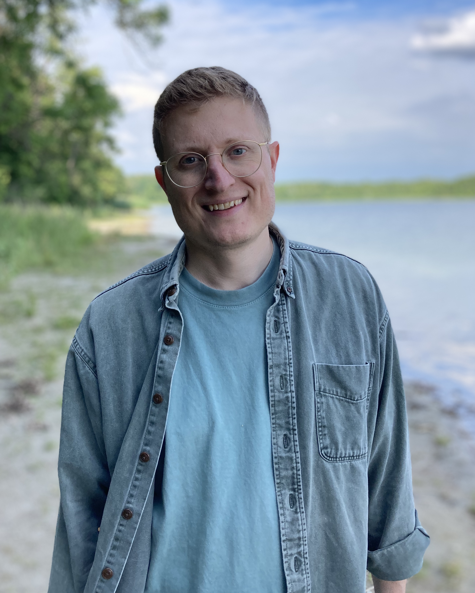

# Homepage

/// html | div[style='float: left; width: 60%;']

I am starting a position as an assistant professor at [Case Western Reserve University](https://mathstats.case.edu/) in the Fall of 2025. Currently, I am a postdoctoral researcher at Université Paris 13. Previously, I was a postdoctoral researcher at Freie Universität Berlin and Michigan State University. From September 1st 2024 to April 30th 2025, I had a research visit at the Max Planck Institute for Mathematics in Bonn. I earned my PhD at Wayne State University under the direction of Andrew Salch.

I research interactions between algebraic topology, arithmetic, and geometry. Specifically, I am interested invariants of ring spectra, such as algebraic K-theory, syntomic cohomology and Hochschild homology. My work uses tools from chromatic, equivariant and motivic homotopy theory.

In addition to my research activity, I have had the opportunity to teach a broad range of courses, mentor research projects and theses, and organize several conferences and seminars. For a more detailed description of my activities see my [CV](static/CV-angeliniknoll.pdf). 

///

/// html | div[style='float: right; width: 30%;']

{: style="width:300px"}

///

/// html | div[style='clear: both;']
///

## Contact

* Prounouns: He/Him/His Test
* University Email: [angelini-knoll](mailto:angelini-knoll@math.univ-paris13.fr) (at math.univ-paris13.fr)
* Personal Email: [gabe.angelini.knoll](mailto:gabe.angelini.knoll@gmail.com) (at gmail dot com)

## Resources

[Algebraic Topology Journals](https://s.wayne.edu/isaksen/algebraic-topology-journals/), 
[Association for Women in Mathematics](https://awm-math.org/),  [eCHT](https://s.wayne.edu/echt/), [European Women in Mathematics](https://www.europeanwomeninmaths.org/), [K-theory Conferences](https://sites.unimi.it/ktf/k-theory-conferences/), [MathMeetings](https://mathmeetings.net/at-gt), [Online Research Seminars](https://researchseminars.org/), [Spectra](https://lgbtmath.org/index.html)

## Collaborators

[CH. Ausoni](https://www.math.univ-paris13.fr/~ausoni/), [M. Behrens](https://www3.nd.edu/~mbehren1/), [E. Belmont](https://sites.google.com/case.edu/ebelmont), [D. L. Culver](https://dlculver.github.io/), [J. Davies](https://sites.google.com/view/jackmdavies/home), [T. Gerhardt](https://users.math.msu.edu/users/gerhar18/Home.html), [J. Hahn](https://web.mit.edu/~jhahn01/www/), [M. A. Hill](https://mikehill.math.umn.edu/), [E. Höning](https://evahoening.netlify.app/), [M. Johnson](https://maxj.phd/), [H. J.  Kong](https://hanajiakong.github.io/), [M. Merling](https://www2.math.upenn.edu/~mmerling/), [M. Péroux](https://www.maximilienperoux.com/), [J.D. Quigley](https://quigleyjd.github.io/), [A. Salch](https://clasprofiles.wayne.edu/profile/dy8211), [J. Rognes](https://www.mn.uio.no/math/personer/vit/rognes/), [D. Wilson](https://dylwil3.github.io/), [T. Yang](https://math.mit.edu/directory/profile.html?pid=2451), [F. Zou](https://zzzflll.github.io/)
